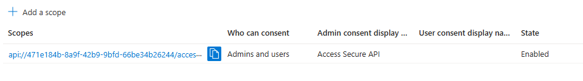

# Lab 4: Microsoft Entra ID Authenticated Web App

In this lab, you will build a secure web application consisting of a **React frontend** and a **Node.js backend API** that uses **Microsoft Entra ID (Azure AD)** for authentication. This end-to-end lab is structured to give students a clear understanding of how enterprise identity systems like Entra ID can be integrated with modern web apps.

---

## Lab Overview

By the end of this lab, you will:

* Register and configure two applications in Entra ID: one for the frontend and one for the backend API.
* Secure a Node.js Express API with Entra ID using bearer token validation.
* Create a React frontend that uses Microsoft Authentication Library (MSAL) to authenticate users and acquire tokens.
* Make authenticated API requests from the frontend using access tokens.

> **NOTE:** This lab assumes **no prior experience** with Azure AD or token-based authentication. Detailed steps, common pitfalls, and explanations are included.

---

## Prerequisites

* Azure subscription with permission to register applications
* Node.js (v18+ recommended)
* A code editor (e.g., VS Code)
* Basic familiarity with JavaScript

> **Optional for Windows Users:**
> You may use WSL if preferred, but this lab works on Windows/macOS/Linux natively.

---

## Step 1: Register Backend API in Entra ID

1. Go to [Microsoft Entra admin center](https://entra.microsoft.com/).
2. Under **"Applications"**, click **"App registrations"** > **"New registration"**.
3. Name it something like: `MySecureAPI`
4. Choose the **Supported account types** as:
   * "Accounts in this organizational directory only"
5. Click **Register**.

### Configure Exposed API

1. After registration, go to the app's **"Expose an API"** section.
2. Click **"Add"** for the Application ID URI. Use the default or custom name (e.g. `api://<client_id>`).
3. Click **Save and continue**
4. On the **"Add a scope"** page:

   * Scope name: `access_as_user`
   * Who can consent: `Admins and users`
   * Admin consent display name: `Access Secure API`
   * Admin consent description: `Allows access to the protected API.`
   * Click **Add scope**
Your full scope URI will look like:


---

## Step 2: Register Frontend App in Entra ID

1. Go back to **App registrations** > **New registration**.
2. Name it: `MyReactClient`
3. Supported account types:

   * "Accounts in this organizational directory only"
4. Redirect URI:

   * Type: `Single-page application (SPA)`
   * URI: `http://localhost:3000`
5. Click **Register**.

### Configure Frontend Authentication

1. Under **"Authentication"**:

   * Enable "Access tokens (used for implicit flows)"
   * Enable "ID tokens"
   * Click **SAVE**
2. Under **"API permissions"**:

   * Click **Add a permission** > **APIs my organization uses**
   * Choose `MySecureAPI` from earlier
   * Select `Delegated permissions` > `access_as_user`
   * Click **Add a permission**
   * Click **Grant admin consent** if you are an admin

### Record the following:

* **Frontend App (Client) ID**
* **Backend App ID URI**
* **Tenant ID**
You can find the values from the overview page of each app registration.
---

## Step 3: Create Backend Node.js API

Open a new terminal window and run the following commands.

```bash
mkdir backend-api && cd backend-api
npm init -y
npm install express morgan cors passport passport-azure-ad dotenv
```

### Create an `backend-api/.env` file and paste the following:

```env
PORT=5000
TENANT_ID=<your_tenant_id>
CLIENT_ID=<backend_api_app_id>
AUDIENCE=api://<backend_app_client_id>
```

Replace <your_tenant_id>, <backend_api_app_id> and api://<backend_app_client_id> with values from your app registrations.

### Create a new file named `backend-api/server.js` and paste the following code

```js
require("dotenv").config();
const express = require("express");
const morgan = require("morgan");
const cors = require("cors");
const passport = require("passport");
const BearerStrategy = require("passport-azure-ad").BearerStrategy;

const app = express();
app.use(morgan("dev"));
app.use(cors());
app.use(express.json());

passport.use(new BearerStrategy({
    identityMetadata: `https://login.microsoftonline.com/${process.env.TENANT_ID}/v2.0/.well-known/openid-configuration`,
    clientID: process.env.CLIENT_ID,
    audience: process.env.AUDIENCE,
    validateIssuer: false, // Set to true if you want to validate the issuer - recommended for production
    passReqToCallback: false,
    loggingLevel: 'info'
}, (token, done) => {
    return done(null, token);
}));

app.use(passport.initialize());

app.get("/api/secure", passport.authenticate("oauth-bearer", { session: false }), (req, res) => {
    res.json({ message: "You have accessed a protected API!", user: req.user });
});

app.get("/api/public", (req, res) => {
    res.json({ message: "This is a public endpoint." });
});

app.listen(process.env.PORT, () => console.log(`API running on http://localhost:${process.env.PORT}`));
```

In the terminal run the API using the following command:

```bash
node server.js
```

Test:

* Open browser: `http://localhost:5000/api/public` → should work.
* `/api/secure` requires a token from the frontend.

---

## Step 4: Create React Frontend

Navigate to your project root directory and run the followingn commands in a terminal window:cd 

```bash
npx create-react-app frontend --template typescript
cd frontend
npm install @azure/msal-browser @azure/msal-react axios
```

### Create a new file `frontend/src/authConfig.ts`

```ts
export const msalConfig = {
  auth: {
    clientId: "<frontend_app_client_id>",
    authority: "https://login.microsoftonline.com/<tenant_id>",
    redirectUri: "http://localhost:3000",
  },
  cache: {
    cacheLocation: "sessionStorage",
    storeAuthStateInCookie: false,
  },
};

export const protectedResources = {
  api: {
    endpoint: "http://localhost:5000/api/secure",
    scopes: ["api://<backend_app_client_id>/access_as_user"],
  },
};
```

Replace <frontend_app_client_id> and <tenant_id> with values from the MyReactClient app registration overview page.
Repalce <backend_app_client_id> with values from the MySecureAPI app registration overview page.

### `src/App.tsx`

```tsx
import React from "react";
import { useMsal, MsalProvider, AuthenticatedTemplate, UnauthenticatedTemplate } from "@azure/msal-react";
import { PublicClientApplication } from "@azure/msal-browser";
import { msalConfig, protectedResources } from "./authConfig";
import axios from "axios";

const msalInstance = new PublicClientApplication(msalConfig);

function SecureContent() {
  const { instance, accounts } = useMsal();

  const callApi = async () => {
    const response = await instance.acquireTokenSilent({
      account: accounts[0],
      scopes: protectedResources.api.scopes,
    });
    const result = await axios.get(protectedResources.api.endpoint, {
      headers: { Authorization: `Bearer ${response.accessToken}` },
    });
    alert(JSON.stringify(result.data));
  };

  return (
    <>
      <p>Welcome, {accounts[0]?.username}!</p>
      <button onClick={callApi}>Call Secure API</button>
      <button onClick={() => instance.logout()}>Logout</button>
    </>
  );
}

function App() {
  const { instance } = useMsal();

  const handleLogin = () => {
    instance.loginRedirect({ scopes: protectedResources.api.scopes });
  };

  return (
    <div>
      <h1>Secure React App</h1>
      <AuthenticatedTemplate>
        <SecureContent />
      </AuthenticatedTemplate>
      <UnauthenticatedTemplate>
        <button onClick={handleLogin}>Login</button>
      </UnauthenticatedTemplate>
    </div>
  );
}

export default function WrappedApp() {
  return (
    <MsalProvider instance={msalInstance}>
      <App />
    </MsalProvider>
  );
}
```

Run the frontend:

```bash
npm start
```

Open browser to `http://localhost:3000`

Login → Call API → You should see the JSON response from the protected API!

---

## Troubleshooting Tips

* **CORS errors:**
  Ensure backend has `cors()` middleware enabled.
* **Invalid audience error:**
  Double-check the `aud` in your token matches your API’s expected audience URI (`api://<client_id>`).
* **Silent token acquisition fails:**
  Ensure scopes are correctly set in Entra ID and match frontend code.
* **401 Unauthorized when calling `/api/secure`:**
  - Verify your `backend-api/.env` values:
    ```ini
    TENANT_ID=<your_tenant_id>
    CLIENT_ID=<your_backend_app_client_id>       # Application (client) ID of the API app registration
    AUDIENCE=api://<your_backend_app_client_id>  # Application ID URI exactly as in "Expose an API"
    ```
  - Restart the Node.js server after any `.env` changes.
  - Enable debug logging for token validation by setting `loggingLevel: 'debug'` in your `BearerStrategy` options to see detailed validation output.
  - Decode your access token at https://jwt.ms/ and confirm that:
    - The `aud` claim matches your `AUDIENCE` value.
    - The `scp` or `roles` claim contains `access_as_user`.
  - In your React frontend, ensure you request the exact scope URI:
    ```ts
    instance.loginRedirect({ scopes: ['api://<your_backend_app_client_id>/access_as_user'] });
    ```
  - Check the browser console and terminal logs for any errors or warnings.

---

## Cleanup  

To avoid lingering resources:

* Delete the two app registrations in Entra ID.
* Stop the local frontend/backend servers.

---
